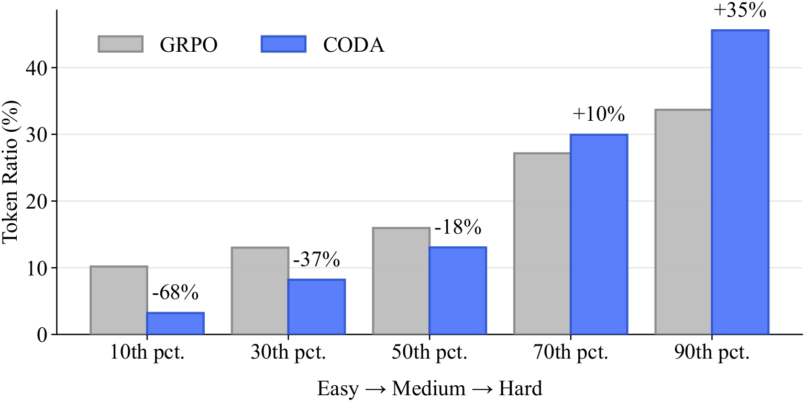

# 🎼 CODA: Difficulty-Aware Compute Allocation for Adaptive Reasoning

<div align="center">

[](https://arxiv.org/abs/2603.08659)
[](https://huggingface.co/collections/Siye01/coda) 

</div>


CODA (**Co**mpute Allocation by **D**ifficulty **A**wareness) dynamically scales reasoning depth by instance difficulty to eliminate overthinking on easy tasks while incentivizing deep deliberation for complex ones.

<p align="center">

</p>

## Highlights

- **An optimality formulation for difficulty-aware compute allocation.**
- **Dual-gated length shaping from rollout-based difficulty.**
- **Evidence for genuine, robust adaptiveness.**

## Repository Structure

```text
coda/
├── examples/
│   ├── coda_train/                 # train scripts (Qwen3-4B/8B/14B)
│   ├── coda_inference/             # validation/inference scripts
│   └── data_preprocess/my_data/    # dataset preprocess scripts
├── data/
│   ├── hf_data/                    # raw dataset files
│   └── parquet_data/               # converted parquet files for training/eval
├── verl/
│   ├── trainer/main_ppo.py         # training entry
│   ├── trainer/main_validate.py    # checkpoint validation entry
│   └── trainer/calculate_metrics.py
```

## Environment Setup

This project is built on top of [veRL](https://github.com/volcengine/verl).

Please follow the official installation guide:

- [veRL installation docs](https://verl.readthedocs.io/en/latest/start/install.html#install-from-custom-environment)

## Model

Our released CODA models are available on Hugging Face and can be downloaded directly:

- [CODA on Hugging Face](https://huggingface.co/collections/Siye01/coda)

## Data Preparation

The repository already contains processed datasets under `data/parquet_data/`.
If you want to rebuild or customize datasets, run scripts under:

- `examples/data_preprocess/my_data/`

Example:

```bash
python3 examples/data_preprocess/my_data/deepscaler/deepscaler.py
```

## Training

### 1) Configure your base model path

In training scripts, set:

```bash
model_path=/path/to/model
```

Scripts:

- `examples/coda_train/train_coda_qwen3_4b.sh`
- `examples/coda_train/train_coda_qwen3_8b.sh`
- `examples/coda_train/train_coda_qwen3_14b.sh`

### 2) Launch training

```bash
bash examples/coda_train/train_coda_qwen3_8b.sh
```

## Validation / Inference

We provide two evaluation modes via `verl.trainer.main_validate`.

### 1) Evaluate from checkpoint

Set:

```bash
model_path=/path/to/model
checkpoint_path=/path/to/ckpt
```

Run:

```bash
bash examples/coda_inference/eval_coda_qwen3_8b_from_ckpt.sh
```

### 2) Evaluate from model

Set:

```bash
model_path=/path/to/model
```

Run:

```bash
bash examples/coda_inference/eval_coda_qwen3_8b_from_model.sh
```

## Metric Calculation

After validation, you can aggregate metrics from generated `.jsonl` outputs:

```bash
python3 verl/trainer/calculate_metrics.py <result_jsonl> --dataset my_data/AIME25 --n_values 8
```

## Citation

If our paper or related resources prove valuable to your research, we kindly ask for a citation.

```bibtex
@article{wu2026coda,
  title={CODA: Difficulty-Aware Compute Allocation for Adaptive Reasoning},
  author={Wu, Siye and Xie, Jian and Zhang, Yikai and Xiao, Yanghua},
  journal={arXiv preprint arXiv:2603.08659},
  year={2026}
}
```

